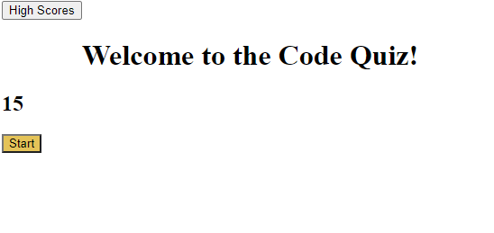

# Code-Quiz

## Project Description 

This is a quick quiz to test your coding skills! When you open the web application you will see a yellow "Start" button. Once clicked, the quiz will begin with 15 seconds on the clock. Any wrong answer will subtract 2 seconds from your time. Try to complete the quiz before the time runs out! Enter your name into the highscore input box and click save. You can find all of the highscores for the game when you click the "High Scores" button. 

## Project Preview 

## Project Link

[Code-Quiz-Link](https://estilbee.github.io/Code-Quiz/)

### Technologies Used
- HTML
- Javascript
- CSS